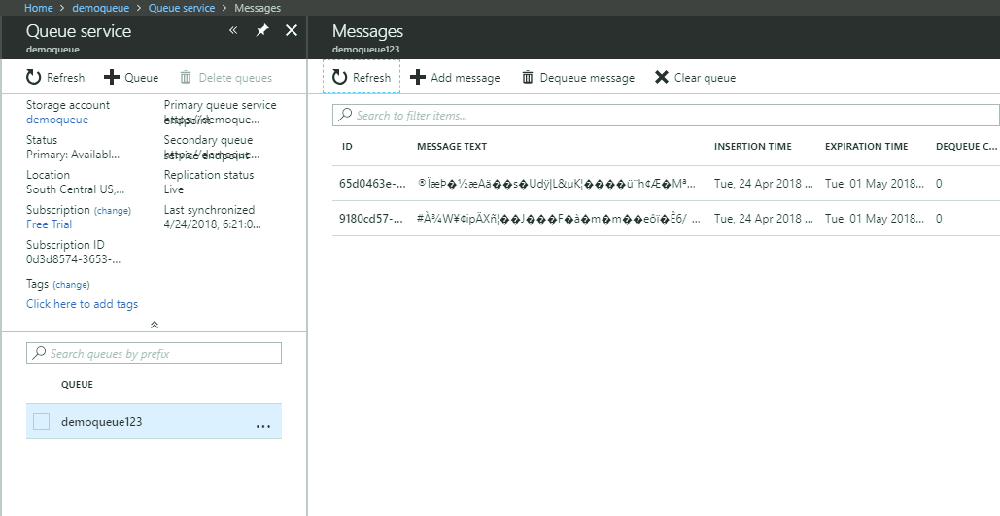

# FoundationsDemo123

## Goal
Send an encrypted message to a Web API, store it, and decrypt the message using Azure Key Vault.
Image that 'Alice' or a customer needs to send us a message securely and it is our business to decrypt the message. 

## **Disclaimer** 
__Not all parts of this application are secure__
__There are connection strings and client secrets stored in source code__ .. This is solely for convenience sake in this demo. 
Do these steps at your _own risk_. You may find it a good exercise to secure the parts of this demo that aren't so secure.

## Setup Steps
1. Create public/private key pair (.pfx) file. The public key we will send to Alice to encrypt with. 
2. Create client-facing web app application to submit encrypted files.
3. Create Azure Storage Account to store the files in a Queue.
4. Create console application to read encrypted files off the queue.
5. Decrypt files with Azure Key Vault.
6. Print secret message to console.

### Encrypted Communication Setup
  Download OpenSSL for Windows.
  https://slproweb.com/products/Win32OpenSSL.html
  
  Create a Self-Signed Certificate by Opening CMD and Running these commands in the install location of OpenSSL (C:\OpenSSL-Win32\bin)
  
  Through this process it will prompt for a password to encrypt/decrypt the private key, choose an easy-to-remember password for this demo.
  
  `openssl req -x509 -sha256 -nodes -days 365 -newkey rsa:2048 -keyout privateKey.key -out cert.crt -config "C:\OpenSSL-Win32\bin\openssl.cfg"`
  
  Create a PFX key pair to upload into Azure Key Vault
  
  `openssl pkcs12 -export -out certificate.pfx -inkey privateKey.key -in cert.crt`
  
  Have OpenSSL make us a public key to hand out to Alice
  
  `openssl rsa -in privateKey.key -pubout > DemoPub.key`
  
  Create a text file on Desktop with text 'Secret Message'.
  Encrypt the file using rsautl
  
  `openssl rsautl -encrypt -pubin -inkey DemoPub.key -in "C:\Users\cjk\Desktop\MessageToEncrypt.txt" -out "C:\Users\cjk\Desktop\secretmessage.txt"`
  
 ### Azure Storage
 We need to set up a place to store our encrypted messages that we are sending so we will create an Azure Storage Account
 With your student Microsoft Imagine License you should be able to receive a free trial with 200$ of credit to your Azure account.
 After you have made an account with Microsoft, log-in to https://portal.azure.com/article-most-common-openssl-commands
 
 I added a storage account called demoqueue which holds storage resources such as Blobs, Files, Tbles and Queues. We will be using a queue
 
 
 
 Click into 'Queue' and click '+ Queue'. 
 We will need to come back from this to get the Queue URL for our application.
 
 ### Sending the file 
 Now we need to create a small web app with a File Input button so we can transmit the encrypted message.
 * Clone this repo, it contains two projects. 
 * The first is a web front-end to upload an encrypted file to the server. (Titled "WebFileUpload") is a console app that reads the encrypted file from the server and decrypts the secret message. (Titled "QueueReader")
 * You should be able to run locally, you can publish to Azure like I do below for easy access. Just note, there is no authentication to the file upload page.
 *You may need to either do a Nuget Restore and/or add the Nuget Packages for 
	WindowsAzure.Storage
	WindowsAzure.ConfigurationManager
 
 Run the application
 Click submit, 
 Select the file from your Desktop that you have encrypted.
 Now it should appear encrypted in the Azure Queue
 
 
 
 ### Decrypt it from our side
 Create a console application that reads encrypted files off the queue and then decrypts them using Azure Key Vault,
 We will then print the secret text to the screen.
 1. Upload our key to Azure Key Vault. Any thing that needs decrypted will go to this vault, pass the data and the api call will decrypt it for us.
 The key does not move. But, we do have to make sure that our authentication into the key vault is secure.
 There is an option to use a certificate which ensures communications are coming from a certain locatino.
 But in this case, we will use a ClientId and a Secret associated with our application.
 Any application can have access to the Key Vault, so you can give another application access to the Key Vault and just use that application's credentials if you so choose.
 
 In this case, we will publish our 'Upload' Web Api project to Azure, Register it to Azure Active Directory and get the ClientId and Client Secret.
 
 
 
 
 
 
 
 Getting the client secret, copy the value to your local machine after save. We will put this in the Console application.
 The client id is here
 But before we forget, let's add our private/public key pair into the vault like so.
 
 
 
 Remember the pfx file created by OpenSSL before? Upload it to Key Vault
 
 
 
 
 The pfx will be located where the openssl executable sits. 
 
 In the portal you will need to add a Key Vault, you can do so by clicking 'Create a Resource'
 
 
 
 Now that there are encrypted messages in the queue, we can take them off the queue and decrypt with our Key Stored in Key Vault
 Open the Queue Reader solution in Visual Studio, make sure to replace all of your names/connection strings to your own.
 Click Run and it will get the first message off the Queue when you type in 'Next'.
 
 If all works, you should see the decrypted message in the Console Window

Credits to: 

https://www.sslshopper.com/article-most-common-openssl-commands.html

https://gist.github.com/crazybyte/4142975
